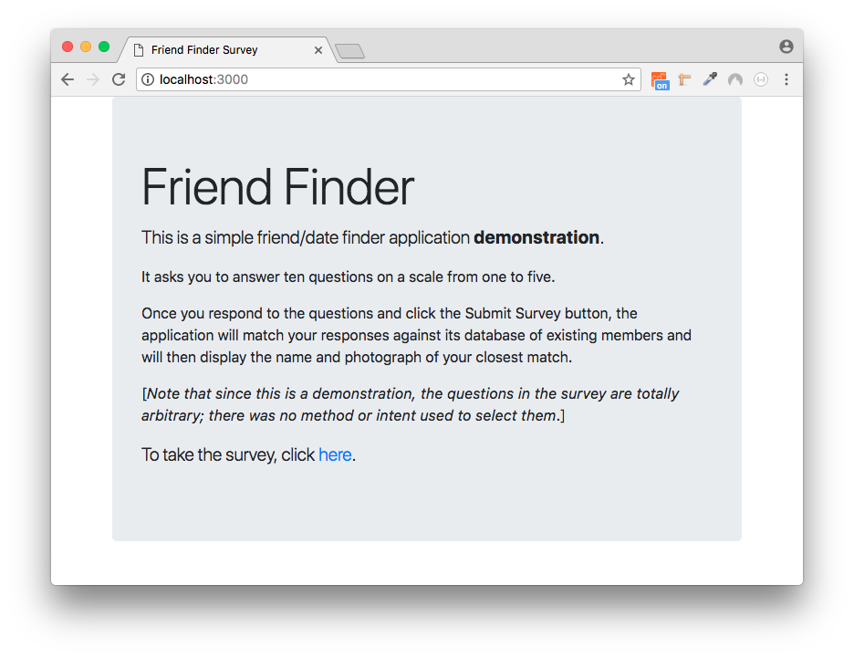
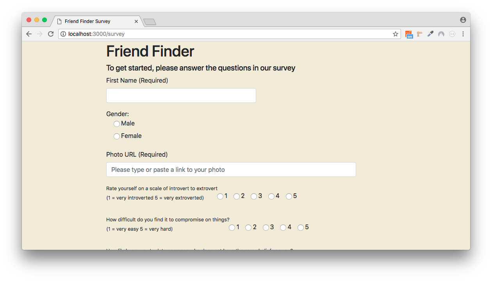
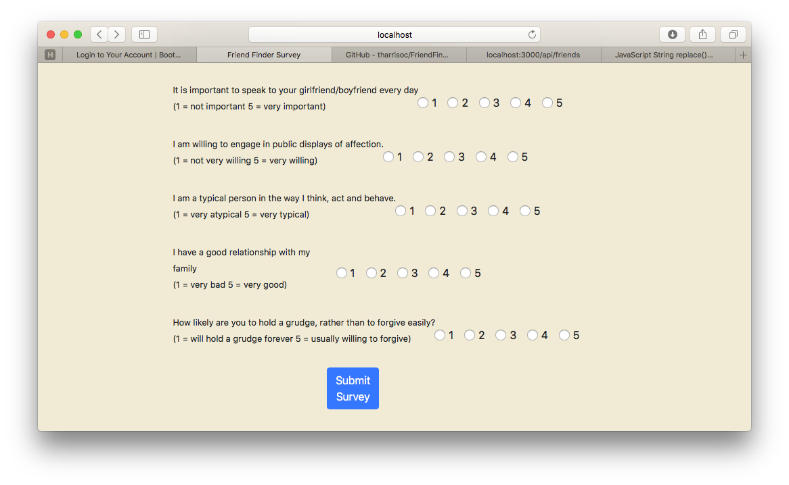
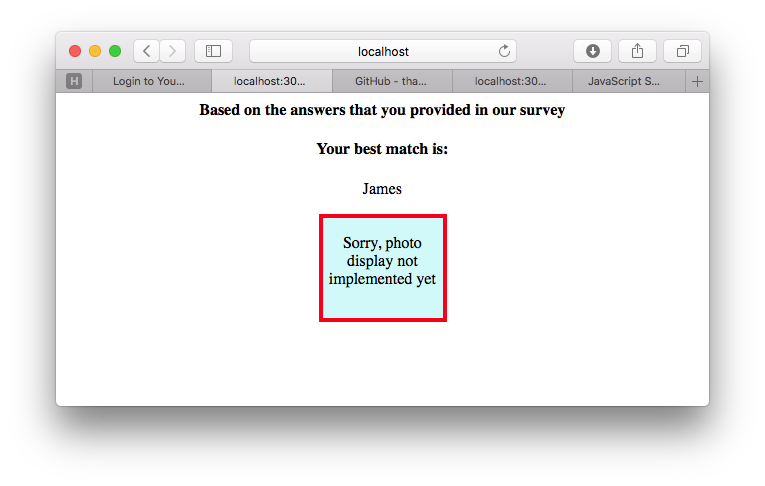
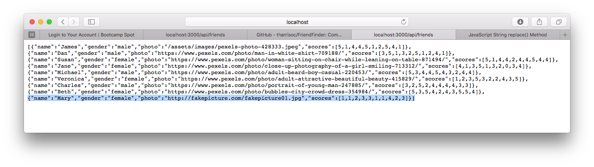

# FriendFinder
Compatibility-based Friend (Date) Finder Application

This application is a demonstration of full-stack processing.

When a browser makes a connection to the node server, the home page of the application is returned.

The home page contains a link back to the server that will deliver a survey form when it is clicked.

Once the user fills out and submits the form, the node application extracts the answers to the survey questions and finds the existing member who most closely matches the new member based on minimizing the differences between the score sets.

The new user then receives a page that shows the name of the best match, and a photo placeholder. [I had a lot of trouble including an actual photo on this page.]

If the user enters the /api/friends route into the browser (e.g. localhost:3000/api/friends), the application will display all of the members in the in-memory database.

### Caveats

* Saving the in-memory database to disk has not been implemented yet. Right now, this array simply provides a starter set of members. Any members that are added during a single session will be remembered and used for matching, but they will not be saved to disk.
* The photo URLs in the starter database are all fake.
* The survey form needs to be aligned better using bootstrap.
* Photo retrieval and display on the best match page needs to be implemented.

